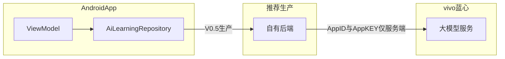

接下来所有开发都必须严格按照本 PLAN 执行。

请先在项目根目录创建一个 PLAN.md 文件，并把以下内容完整写入 PLAN.md。后续每次开发、修改、重构、修复 bug，都必须先读取 PLAN.md，并严格遵守其中的范围、功能、页面、技术栈和限制。

如果用户没有明确提出新增功能，你不得擅自增加功能。
如果用户没有明确提出删除功能，你不得擅自删除功能。
如果发现需求不清楚，先按 PLAN.md 中已有内容实现，不要自行扩展。
如果你认为某个功能需要调整，必须先说明原因，等待用户确认后再修改。

==============================
蓝心知径 Android APP 开发计划
==============================

一、项目定位

项目名称：
蓝心知径｜AI 知识树学习助手

项目类型：
移动端 Android 原生 APP Demo

项目目标：
开发一个可以在 Android 手机或模拟器上运行的原生 APP Demo，用于比赛展示和产品演示。

核心定位：
蓝心知径不是普通 AI 答题器，也不是普通文档总结器。

普通 AI 的重点是直接回答问题。
蓝心知径的重点是：
1. 识别学习内容
2. 判断核心考点
3. 分析用户可能卡点
4. 拆解知识节点
5. 形成个人知识树
6. 支持节点追问
7. 支持费曼复述
8. 根据复述结果更新掌握度

本阶段只做可演示 Demo，不接真实 AI、不接真实 OCR、不接真实文档解析、不做登录注册、不做后台系统。

二、技术栈固定要求

必须使用：
1. Kotlin
2. Jetpack Compose
3. Material 3
4. Navigation Compose
5. MVVM 简单架构
6. Mock 数据
7. minSdk 26

不得使用：
1. React
2. Vue
3. Flutter
4. WebView
5. H5 页面
6. 后台管理系统
7. 真实 AI 接口
8. 真实登录注册
9. 真实数据库服务端

如果当前项目不是 Android 原生项目，需要创建标准 Android 项目结构。

建议包名：
com.lanxin.zhijing

APP 名称：
蓝心知径

三、项目开发原则

1. 严格按照本计划开发。
2. 不允许随意增加页面。
3. 不允许随意删除页面。
4. 不允许随意增加复杂功能。
5. 不允许把项目改成普通聊天机器人。
6. 不允许把项目改成普通错题本。
7. 不允许把项目改成单纯知识库。
8. 不允许把项目做成 Web App。
9. 所有功能先用 mock 数据实现。
10. 所有页面必须能点击跳转。
11. 所有代码必须保持清晰、组件化、可维护。
12. 如果要调整功能范围，必须等待用户确认。

四、固定页面范围

本阶段只开发以下 6 个页面：

1. HomeScreen
首页 / 学习入口页

2. AnalysisScreen
AI 学习分析页

3. KnowledgeTreeScreen
个人知识树页

4. NodeFocusScreen
节点聚焦对话页

5. ReviewScreen
费曼复述与复习页

6. ProfileScreen
我的页面，简单占位即可

不得擅自新增：
1. 登录页
2. 注册页
3. 设置页
4. 消息页
5. 商城页
6. 会员页
7. 课程购买页
8. 后台管理页
9. 复杂个人资料页
10. 真实上传文件页

五、固定底部导航

底部导航栏固定 4 项：

1. 首页
2. 知识树
3. 复习
4. 我的

底部导航要求：
1. 固定在底部
2. 当前页面高亮蓝色
3. 首页点击进入 HomeScreen
4. 知识树点击进入 KnowledgeTreeScreen
5. 复习点击进入 ReviewScreen
6. 我的点击进入 ProfileScreen

不要擅自增加底部导航项。

六、固定页面跳转关系

启动 APP 后默认进入：
HomeScreen

HomeScreen 点击：
1. 拍一道错题 -> AnalysisScreen
2. 截图识别 -> AnalysisScreen
3. 最近学习中的“导数与单调性” -> KnowledgeTreeScreen

AnalysisScreen 点击：
1. 查看知识树 -> KnowledgeTreeScreen
2. 获取分步提示 -> NodeFocusScreen
3. 加入错题本 -> Toast：已加入错题本

KnowledgeTreeScreen 点击：
1. 中心节点“导数与单调性” -> NodeFocusScreen
2. 导数符号节点 -> NodeFocusScreen
3. 单调区间节点 -> NodeFocusScreen

NodeFocusScreen 点击：
1. 分步提示 -> 展开提示卡片
2. 讲给同学听 -> ReviewScreen
3. 相关错题 -> Toast：已展示相关错题
4. 加入复习 -> Toast：已加入复习计划

ReviewScreen 点击：
1. 下一步：完成 2 道同类题 -> Toast：已生成 2 道同类练习题

七、页面一：HomeScreen 首页 / 学习入口页

页面参考：
01_学习入口页

必须包含：

顶部标题：
蓝心知径

副标题：
把题目、教材和文档变成你的个人知识树

今日学习建议卡片：
标题：今日学习建议
主文案：先补「导数符号与单调区间」
说明：根据最近错题与复述表现生成
掌握度：42%
进度条：蓝色

四个入口卡片，2 x 2 布局：
1. 拍一道错题
副标题：错因诊断

2. 导入教材/笔记
副标题：生成知识树

3. 粘贴文档内容
副标题：拆解概念

4. 截图识别
副标题：系统级入口

最近学习列表：
1. 导数与单调性 42%
2. 经济基础与上层建筑 68%
3. 细胞呼吸 55%
4. 工业革命 73%

每个最近学习项必须包含：
1. 标题
2. 百分比
3. 进度条
4. 圆角卡片样式

八、页面二：AnalysisScreen AI 学习分析页

页面参考：
02_AI学习分析页

必须包含：

顶部标题：
AI 学习分析

副标题：
已识别你的学习内容

识别结果卡片：
内容类型：数学错题
核心考点：导数与函数单调性

关联知识点标签：
1. 导数计算
2. 导数符号
3. 单调区间
4. 极值判断
5. 参数讨论

可能卡点卡片：
标题：可能卡点
内容：
你可能不是不会求导，而是不熟悉“导数符号变化”和“函数增减性”的关系。

建议学习路径：
导数定义 -> 几何意义 -> 导数符号 -> 单调性 -> 极值判断

底部按钮：
1. 查看知识树
2. 获取分步提示
3. 加入错题本

浅绿色提示卡：
标题：比普通 AI 多做一步
内容：
不是直接给答案，而是先判断：考什么、卡在哪、先补哪条知识链。

九、页面三：KnowledgeTreeScreen 个人知识树页

页面参考：
03_个人知识树页

必须包含：

顶部标题：
我的知识树

副标题：
中心节点：导数与单调性 42%

知识树区域：
使用 Jetpack Compose Canvas 或 Box 叠加实现。
不得引入复杂图谱库。

中心节点：
导数与单调性
42%

周围节点：
1. 函数基础 80% 绿色
2. 导数定义 70% 绿色
3. 几何意义 55% 黄色
4. 导数符号 45% 黄色
5. 单调区间 42% 蓝色
6. 极值判断 38% 红色
7. 参数讨论 25% 红色

节点之间连线：
1. 函数基础 -> 导数定义
2. 导数定义 -> 导数与单调性
3. 导数符号 -> 单调区间
4. 单调区间 -> 极值判断
5. 导数与单调性 -> 参数讨论

关系示例卡片：
标题：关系示例

内容：
绿色圆点：函数基础 -> 前置 -> 导数定义
蓝色圆点：导数符号 -> 影响 -> 单调区间
红色圆点：单调区间 -> 前置 -> 极值判断

底部建议：
系统建议：先复习“导数符号与单调区间”

十、页面四：NodeFocusScreen 节点聚焦对话页

页面参考：
04_节点聚焦对话页

必须包含：

顶部标题：
节点聚焦

副标题：
导数与单调性 · 掌握度 42%

当前节点卡片：
当前节点：导数与单调性
掌握度：42%
蓝色进度条

相关节点标签：
1. 导数符号
2. 单调区间
3. 极值判断

对话内容：

AI：
你现在卡在“导数符号如何影响函数走势”。建议先理解：f'(x)>0 表示函数在该区间内整体上升。

我：
为什么 f'(x)>0 时，函数就是递增的？

AI：
可以把导数理解成函数图像在某一点的倾斜方向。当 f'(x)>0 时，切线斜率为正，图像向右上方延伸。

快捷按钮：
1. 分步提示
2. 讲给同学听
3. 相关错题
4. 加入复习

点击“分步提示”后展开：

提示 1：先判断导数符号
提示 2：再看该符号在区间内是否稳定
提示 3：如果 f'(x)>0，函数在该区间递增；如果 f'(x)<0，函数在该区间递减。

底部输入框：
placeholder：
继续追问这个知识点...

发送逻辑：
用户输入文字后，追加用户气泡，并自动追加一条 mock AI 回复：
这个问题仍然和导数符号、单调区间有关，我建议先回到导数的几何意义理解。

十一、页面五：ReviewScreen 费曼复述与复习页

页面参考：
05_费曼复述与复习页

必须包含：

顶部标题：
讲给同学听

副标题：
费曼复述 · 掌握度更新

AI 提问卡片：
标题：AI 提问
内容：
请你不用公式，讲给同学听：为什么导数可以判断函数的增减？

用户回答卡片：
标题：用户回答
内容：
因为导数表示函数变化的方向。导数大于 0 时，函数值会增加；导数小于 0 时，函数值会减少。

AI 反馈卡片：
标题：AI 反馈
得分：78 / 100
等级标签：基本理解

做得好的地方：
说出了导数和函数变化趋势有关。

还需要补充：
1. 可以补充“切线斜率”的解释
2. 判断单调性时，要看区间内导数符号是否稳定
3. 还没有说明导数符号变化与极值点的关系

掌握度变化卡片：
标题：掌握度变化
内容：导数与单调性
变化：42% -> 68%
使用绿色进度条展示

底部主按钮：
下一步：完成 2 道同类题

十二、页面六：ProfileScreen 我的页面

ProfileScreen 只做简单占位，不要扩展复杂功能。

必须包含：
标题：我的
副标题：学习画像与个人设置

占位卡片：
1. 学习天数：7 天
2. 已沉淀知识点：26 个
3. 待复习节点：5 个

提示文案：
个人学习画像将在后续版本完善。

不得添加：
1. 登录注册
2. 会员系统
3. 个人隐私资料
4. 账号绑定
5. 设置中心

十三、UI 风格固定要求

整体风格必须参考原型图。

颜色：

背景色：
#F6FAFD

主色蓝：
#3F7BFF

绿色：
#42C77A

黄色：
#F6AD3D

红色：
#EF5B5B

深色文字：
#152033

次级文字：
#65758B

边框色：
#DCE8F5

卡片要求：
1. 大圆角
2. 浅色边框
3. 轻微阴影
4. 内边距充足
5. 不要厚重商务风
6. 不要花哨渐变
7. 不要大面积深色背景

字体要求：
1. 使用中文系统字体
2. 页面标题加大加粗
3. 卡片标题加粗
4. 副标题使用灰蓝色
5. 不要出现英文占位文案

补充要求：UI 参考图存放位置

本项目的 UI 原型参考图已经统一放在项目根目录的 picture 目录下。

picture 目录中包含以下参考图：

1. 01_学习入口页.png
2. 02_AI学习分析页.png
3. 03_个人知识树页.png
4. 04_节点聚焦对话页.png
5. 05_费曼复述与复习页.png

后续开发 UI 页面时，必须优先参考 picture 目录下对应的原型图。

页面对应关系：

HomeScreen 对应：
picture/01_学习入口页.png

AnalysisScreen 对应：
picture/02_AI学习分析页.png

KnowledgeTreeScreen 对应：
picture/03_个人知识树页.png

NodeFocusScreen 对应：
picture/04_节点聚焦对话页.png

ReviewScreen 对应：
picture/05_费曼复述与复习页.png

开发要求：

1. 每开发一个页面前，先查看 picture 目录中对应的参考图。
2. 页面布局、卡片层级、颜色风格、圆角、间距、按钮样式、底部导航，都要尽量贴近参考图。
3. 不允许在没有用户确认的情况下，随意改变原型图中的页面结构。
4. 不允许把参考图风格改成其他 APP 风格。
5. 如果参考图和 PLAN.md 中的文字要求有冲突，优先遵守 PLAN.md 的功能范围，同时尽量保持参考图视觉效果。
6. 如果 picture 目录中缺少某张图，先说明缺失情况，不要自行脑补新增页面。
7. ProfileScreen 没有专门参考图，只做 PLAN.md 中规定的简单占位页面即可。

十四、固定数据模型

Models.kt 中必须包含：

data class LearningItem(
    val id: String,
    val title: String,
    val progress: Int,
    val status: String
)

data class KnowledgeNode(
    val id: String,
    val label: String,
    val progress: Int,
    val type: String
)

data class KnowledgeRelation(
    val from: String,
    val relation: String,
    val to: String
)

data class ChatMessage(
    val role: String,
    val content: String
)

十五、固定 Mock 数据

MockData.kt 中必须包含：

learningItems:
1. derivative / 导数与单调性 / 42 / weak
2. economy / 经济基础与上层建筑 / 68 / good
3. cell / 细胞呼吸 / 55 / medium
4. industry / 工业革命 / 73 / good

knowledgeNodes:
1. function / 函数基础 / 80 / good
2. definition / 导数定义 / 70 / good
3. geometry / 几何意义 / 55 / medium
4. symbol / 导数符号 / 45 / medium
5. monotonic / 单调区间 / 42 / focus
6. extreme / 极值判断 / 38 / weak
7. parameter / 参数讨论 / 25 / weak

relations:
1. 函数基础 -> 前置 -> 导数定义
2. 导数符号 -> 影响 -> 单调区间
3. 单调区间 -> 前置 -> 极值判断

initialChatMessages:
1. AI：你现在卡在“导数符号如何影响函数走势”。建议先理解：f'(x)>0 表示函数在该区间内整体上升。
2. USER：为什么 f'(x)>0 时，函数就是递增的？
3. AI：可以把导数理解成函数图像在某一点的倾斜方向。当 f'(x)>0 时，切线斜率为正，图像向右上方延伸。

十六、固定项目结构

项目结构应尽量保持如下：

app/src/main/java/com/lanxin/zhijing/
├── MainActivity.kt
├── navigation/
│   └── AppNavGraph.kt
├── data/
│   ├── Models.kt
│   └── MockData.kt
├── viewmodel/
│   └── LearningViewModel.kt
└── ui/
    ├── theme/
    │   ├── Color.kt
    │   ├── Theme.kt
    │   └── Type.kt
    ├── components/
    │   ├── AppScaffold.kt
    │   ├── BottomNavBar.kt
    │   ├── PageHeader.kt
    │   ├── AppCard.kt
    │   ├── ProgressBar.kt
    │   ├── TagChip.kt
    │   ├── LearningItemCard.kt
    │   ├── KnowledgeGraph.kt
    │   └── ChatBubble.kt
    └── screens/
        ├── HomeScreen.kt
        ├── AnalysisScreen.kt
        ├── KnowledgeTreeScreen.kt
        ├── NodeFocusScreen.kt
        ├── ReviewScreen.kt
        └── ProfileScreen.kt

十七、必须封装的组件

必须封装：

1. AppScaffold
负责整体页面结构和底部导航栏

2. BottomNavBar
负责底部导航

3. PageHeader
负责页面标题和副标题

4. AppCard
负责统一卡片样式

5. ProgressBar
负责统一进度条

6. TagChip
负责知识点标签

7. LearningItemCard
负责最近学习卡片

8. KnowledgeGraph
负责知识树展示

9. ChatBubble
负责 AI 和用户对话气泡

不得把所有 UI 都写在 MainActivity.kt 中。

十八、阶段开发顺序

必须按以下顺序开发，不要跳步：

第一阶段：项目基础搭建
1. 创建 Android Compose 项目
2. 配置 Kotlin、Compose、Material3、Navigation Compose
3. 设置包名和 APP 名称
4. 创建基础目录结构
5. 创建主题颜色

第二阶段：基础组件开发
1. AppScaffold
2. BottomNavBar
3. PageHeader
4. AppCard
5. ProgressBar
6. TagChip

第三阶段：Mock 数据和 ViewModel
1. Models.kt
2. MockData.kt
3. LearningViewModel.kt

第四阶段：首页开发
1. HomeScreen
2. 今日学习建议卡片
3. 四个入口卡片
4. 最近学习列表
5. 跳转到 AnalysisScreen 和 KnowledgeTreeScreen

第五阶段：AI 学习分析页开发
1. AnalysisScreen
2. 识别结果卡片
3. 关联知识点标签
4. 可能卡点卡片
5. 建议学习路径
6. 三个按钮
7. 页面跳转和 Toast

第六阶段：知识树页开发
1. KnowledgeTreeScreen
2. KnowledgeGraph
3. 节点圆形布局
4. 节点连线
5. 关系示例卡片
6. 节点点击跳转

第七阶段：节点聚焦对话页开发
1. NodeFocusScreen
2. 当前节点卡片
3. 相关节点标签
4. ChatBubble
5. 快捷按钮
6. 分步提示展开
7. 输入框和 mock 回复

第八阶段：费曼复述页开发
1. ReviewScreen
2. AI 提问卡片
3. 用户回答卡片
4. AI 反馈卡片
5. 掌握度变化卡片
6. 下一步按钮和 Toast

第九阶段：我的页面开发
1. ProfileScreen
2. 简单学习画像占位
3. 不做复杂功能

第十阶段：整体检查
1. Gradle Sync
2. App 启动
3. 页面跳转
4. 底部导航
5. Toast
6. 输入框
7. 知识树显示
8. 无明显报错
9. 无英文占位文案
10. UI 风格接近原型图

十九、禁止擅自开发的功能

除非用户明确要求，否则不得开发：

1. 登录注册
2. 账号系统
3. 会员系统
4. 支付系统
5. 课程购买
6. 真实 AI 接口
7. 真实 OCR
8. 真实拍照识别
9. 真实文件上传
10. 真实数据库云同步
11. 社区功能
12. 排行榜
13. 打卡分享
14. 消息通知系统
15. 设置页
16. 主题切换
17. 多语言
18. 复杂动画
19. 后台管理系统
20. WebView 页面

二十、允许的最小交互

本阶段只允许这些交互：

1. 页面跳转
2. Toast 提示
3. 分步提示展开/收起
4. 输入框输入文字
5. 发送后追加 mock 对话
6. 知识树节点点击
7. 底部导航切换

二十一、验收标准

每次开发完成后必须自查：

1. 是否严格遵守 PLAN.md
2. 是否没有擅自新增功能
3. 是否没有擅自删除功能
4. 是否可以正常 Gradle Sync
5. 是否可以正常运行到模拟器或真机
6. 首页是否正常显示
7. 五个核心页面是否都能进入
8. 底部导航是否正常
9. 知识树是否有节点和连线
10. 节点聚焦页是否能模拟对话
11. 费曼复述页是否有评分和掌握度变化
12. 我的页面是否只是简单占位
13. UI 是否接近原型图
14. 是否没有英文占位文案
15. 是否没有明显崩溃

二十二、后续扩展规则

如果未来要扩展真实能力，只能在用户明确要求后进行。

可能的后续扩展方向包括：
1. 接入真实 AI 分析（详见「二十四、蓝心大模型 AI 接入规范」；正式接入属 **V0.5**；生产环境须通过自有后端代理，**AppKEY 不得放在客户端**）
2. 接入 OCR
3. 接入文档解析
4. 接入本地数据库 Room
5. 接入知识树长期存储
6. 接入 vivo 端侧能力
7. 接入复习提醒

但这些都不属于当前阶段。
当前阶段只做可演示 Android 原生 APP Demo。

二十三、Cursor 工作要求

你每次开始开发前，必须先做以下动作：

1. 读取 PLAN.md
2. 对照当前用户要求，判断是否属于 PLAN.md 范围
3. 如果属于范围，直接实现
4. 如果不属于范围，先提醒用户该需求超出当前 PLAN，等待确认
5. 修改代码后，说明修改了哪些文件
6. 不要输出大量无关解释
7. 不要把项目改成其他技术栈
8. 不要自行改变产品方向

二十四、蓝心大模型 AI 接入规范

零、官方文档与实现依据

1. 官方文档入口：https://aigc.vivo.com.cn/#/document/index?id=1746（单页应用；若 vivo 调整入口或文档编号，以 vivo AIGC 平台当前展示为准）。
2. **具体** HTTP(S) 地址、Path、鉴权方式（如 Header 名、签名算法、时间戳、Body 字段名）、以及平台返回的**原始**响应结构，**必须以该文档（及后续版本）为准**；本 PLAN **不**写入、**不**臆测、**不**维护具体 URL 或签名字段，以免与官方变更不一致。
3. 实施 **V0.5** 的 `VivoLanxinAiRepository` 前，须在可正常访问文档的环境下**逐条对照**后再编写网络层与解析逻辑。
4. **架构原则**：生产环境 Android 客户端只调用**自有后端**；由后端持有 AppID 与 AppKEY 调用 vivo 蓝心大模型；客户端日志、崩溃上报与接口报错信息中**不得**出现 AppKEY。
5. 下列示意图仅表达职责边界，**不代表** vivo 官方拓扑或接口形态：

==============================
蓝心大模型 AI 接入规范
==============================

一、AI 接入目标

蓝心知径后续需要接入 vivo 蓝心大模型能力，用于实现：

1. 学习内容分析
2. 考点识别
3. 可能卡点判断
4. 知识点提取
5. 知识关系生成
6. 节点追问
7. 分步提示
8. 费曼复述评分
9. 掌握度更新建议
10. 复习任务生成

注意：
AI 不能只是普通聊天。
AI 输出必须服务于「知识树学习助手」的产品主线。

二、当前阶段执行规则

当前 V0.1 阶段仍然使用 MockAiLearningRepository。

不要现在直接把真实蓝心大模型接口接进页面。
不要把 AppKEY 写进 Android 项目。
不要在 UI 页面里直接写 HTTP 请求。
不要把 AI 调用逻辑写进 Composable 页面。

当前阶段只做：
1. 保留 Mock AI 流程
2. 创建 AI 接口抽象
3. 预留 VivoLanxinAiRepository 文件
4. 预留后续接入位置
5. 在 PLAN.md 中明确真实接入属于 V0.5 阶段

三、密钥安全要求

AppID 可以作为普通配置处理，但 AppKEY 必须按密钥处理。

禁止：

1. 禁止把 AppKEY 写死在 Kotlin 代码里
2. 禁止把 AppKEY 写进 build.gradle
3. 禁止把 AppKEY 写进 AndroidManifest.xml
4. 禁止把 AppKEY 写进 PLAN.md
5. 禁止把 AppKEY 写进 README
6. 禁止把 AppKEY 提交到 GitHub
7. 禁止在 Logcat 中打印 AppKEY
8. 禁止在报错信息中显示 AppKEY

生产环境推荐方案：

Android APP
↓
自己的后端接口
↓
后端保存 AppID / AppKEY
↓
后端调用 vivo 蓝心大模型
↓
后端返回结构化结果给 Android APP

原因：
Android APK 可以被反编译，如果把 AppKEY 放在客户端，密钥有泄露风险。

四、开发阶段临时方案

如果用户后续明确要求在 Android 端临时直连蓝心大模型进行测试，只能作为 Debug 测试方案。

Debug 测试时：

1. 把 AppID 和 AppKEY 放在 local.properties
2. local.properties 必须加入 .gitignore
3. 通过 Gradle BuildConfig 读取
4. 只能 Debug 使用
5. Release 版本不允许直连携带 AppKEY
6. 不允许打印 AppKEY
7. 不允许把 local.properties 提交到仓库

示例原则：

local.properties 中可以放：
VIVO_APP_ID=用户自己的 AppID
VIVO_APP_KEY=用户自己的 AppKEY

但不要在任何公开文件中写真实值。

五、AI Repository 设计

必须创建统一 AI 接口：

interface AiLearningRepository {

    suspend fun analyzeLearningContent(
        text: String,
        sourceType: ImportSource
    ): Result<LearningAnalysisResult>

    suspend fun askNodeQuestion(
        nodeContext: NodeQuestionContext,
        question: String
    ): Result<String>

    suspend fun generateStepHints(
        nodeContext: NodeQuestionContext
    ): Result<List<String>>

    suspend fun evaluateFeynmanAnswer(
        request: FeynmanEvaluationRequest
    ): Result<FeynmanEvaluationResult>
}

必须保留两个实现：

1. MockAiLearningRepository
当前 V0.1 使用，返回固定 mock 数据。

2. VivoLanxinAiRepository
V0.5 接入真实蓝心大模型时使用。

注意：
UI 页面只能依赖 ViewModel。
ViewModel 只能依赖 AiLearningRepository。
不要让 UI 直接依赖 VivoLanxinAiRepository。

六、AI 数据模型设计

LearningAnalysisResult 至少包含：

data class LearningAnalysisResult(
    val contentType: String,
    val coreTopic: String,
    val relatedKnowledgePoints: List<String>,
    val possibleWeakness: String,
    val suggestedPath: List<String>,
    val nodes: List<KnowledgeNode>,
    val relations: List<KnowledgeRelation>
)

NodeQuestionContext 至少包含：

data class NodeQuestionContext(
    val nodeId: String,
    val nodeTitle: String,
    val nodeDescription: String,
    val mastery: Int,
    val relatedNodes: List<KnowledgeNode>,
    val recentMistakes: List<String>,
    val recentReviewFeedback: List<String>
)

FeynmanEvaluationRequest 至少包含：

data class FeynmanEvaluationRequest(
    val nodeId: String,
    val nodeTitle: String,
    val question: String,
    val userAnswer: String,
    val masteryBefore: Int
)

FeynmanEvaluationResult 至少包含：

data class FeynmanEvaluationResult(
    val score: Int,
    val level: String,
    val strengths: List<String>,
    val weaknesses: List<String>,
    val suggestions: List<String>,
    val masteryBefore: Int,
    val masteryAfter: Int,
    val nextTasks: List<String>
)

七、蓝心大模型输出要求

为了方便 App 解析，调用蓝心大模型时，提示词必须要求模型返回严格 JSON。

不要让模型返回大段散文。
不要让模型返回 Markdown 表格。
不要让模型随意改变字段名。

学习内容分析的 AI 输出必须类似：

{
  "contentType": "数学错题",
  "coreTopic": "导数与函数单调性",
  "relatedKnowledgePoints": ["导数计算", "导数符号", "单调区间", "极值判断", "参数讨论"],
  "possibleWeakness": "你可能不是不会求导，而是不熟悉导数符号变化和函数增减性的关系。",
  "suggestedPath": ["导数定义", "几何意义", "导数符号", "单调性", "极值判断"],
  "nodes": [
    {
      "id": "symbol",
      "label": "导数符号",
      "progress": 45,
      "type": "medium"
    }
  ],
  "relations": [
    {
      "from": "导数符号",
      "relation": "影响",
      "to": "单调区间"
    }
  ]
}

八、学习内容分析 Prompt 规范

VivoLanxinAiRepository 中需要准备一个学习分析 Prompt。

Prompt 目标：
把用户导入的题目、教材、笔记、文档或截图 OCR 文本，分析成结构化学习结果。

Prompt 要求：

你是「蓝心知径」的 AI 学习分析引擎。
你的任务不是直接给答案，而是帮助学习者判断：
1. 这是什么学习内容
2. 核心考点是什么
3. 关联知识点有哪些
4. 用户可能卡在哪里
5. 应该先补哪条知识链
6. 这次内容应该沉淀成哪些知识节点
7. 节点之间有什么关系

请严格返回 JSON，不要输出 Markdown，不要输出解释文字。

九、节点追问 Prompt 规范

节点追问不能变成普通聊天。

Prompt 要求：

你是「蓝心知径」的节点学习教练。
当前用户正在学习某个知识节点。
请根据：
1. 当前节点
2. 相邻节点
3. 用户掌握度
4. 用户问题
5. 最近错题或复述反馈

给出适合学习者理解的回答。

回答要求：
1. 不要只给最终答案
2. 优先解释用户卡点
3. 可以给例子
4. 可以引导用户自己思考
5. 回答要围绕当前知识节点
6. 不要跑题

十、分步提示 Prompt 规范

分步提示用于引导用户，而不是一次性给完整答案。

Prompt 要求：

请围绕当前知识节点生成 3 到 5 条分步提示。
提示必须从简单到深入。
每条提示要短。
不要直接给最终完整答案。
返回 JSON 数组。

十一、费曼复述评分 Prompt 规范

费曼复述评分用于判断用户是否真正理解。

Prompt 要求：

你是「蓝心知径」的费曼复述评分教练。
请根据用户对知识点的复述内容进行评分。

你需要判断：
1. 用户是否说出了核心概念
2. 用户是否能用自己的话解释
3. 用户是否遗漏关键前置知识
4. 用户是否存在理解误区
5. 用户下一步应该补什么

请返回严格 JSON：

{
  "score": 78,
  "level": "基本理解",
  "strengths": ["说出了导数和函数变化趋势有关"],
  "weaknesses": ["缺少切线斜率解释", "没有说明区间内导数符号是否稳定"],
  "suggestions": ["补充导数几何意义", "完成 2 道同类题"],
  "masteryBefore": 42,
  "masteryAfter": 68,
  "nextTasks": ["完成 2 道同类题", "复习导数符号与单调区间"]
}

十二、错误处理要求

AI 调用必须处理：

1. 网络失败
2. 鉴权失败
3. 接口限流
4. 响应为空
5. JSON 解析失败
6. 模型返回格式不符合要求
7. 请求超时

UI 层必须显示：

1. 加载中
2. 分析失败
3. 重试按钮
4. 使用 mock 示例继续体验，后续可选

十三、AI 接入阶段安排

V0.1：
使用 MockAiLearningRepository。
只预留接口，不接真实 AI。

V0.2：
Room 保存 AI 分析结果的数据结构。

V0.3：
真实导入内容，但 AI 仍可 mock。

V0.4：
OCR 和文本抽取后，将真实文本传入分析流程，但 AI 仍可 mock 或 Debug 接入。

V0.5：
正式接入 vivo 蓝心大模型。
实现 VivoLanxinAiRepository。
AnalysisScreen 使用真实 AI 结果。
NodeFocusScreen 使用真实 AI 回复。
ReviewScreen 使用真实 AI 评分。

十四、Cursor 当前任务

当前不要直接接入真实蓝心大模型。

现在只做：

1. 阅读 vivo 官方文档，了解接口调用方式
2. 更新 PLAN.md 的 AI 接入规范
3. 创建 AiLearningRepository 接口
4. 创建 MockAiLearningRepository
5. 创建 VivoLanxinAiRepository 空实现或 TODO 实现
6. 创建 AI 相关数据模型
7. 确保当前 V0.1 仍然使用 MockAiLearningRepository
8. 不要写入真实 AppKEY
9. 不要打印 AppKEY
10. 不要把密钥提交到仓库

十五、后续真实接入时再做

当用户明确说「开始接入蓝心大模型」时，再执行：

1. 按 vivo 文档配置请求地址
2. 按 vivo 文档实现鉴权
3. 按 vivo 文档组装请求体
4. 按 vivo 文档解析响应体
5. 接入 Loading / Error / Retry 状态
6. 使用严格 JSON Prompt
7. 测试学习分析、节点追问、费曼评分三类调用

最终目标：
做出一个稳定、简洁、可演示、符合原型图风格的 Android 原生 APP Demo。
